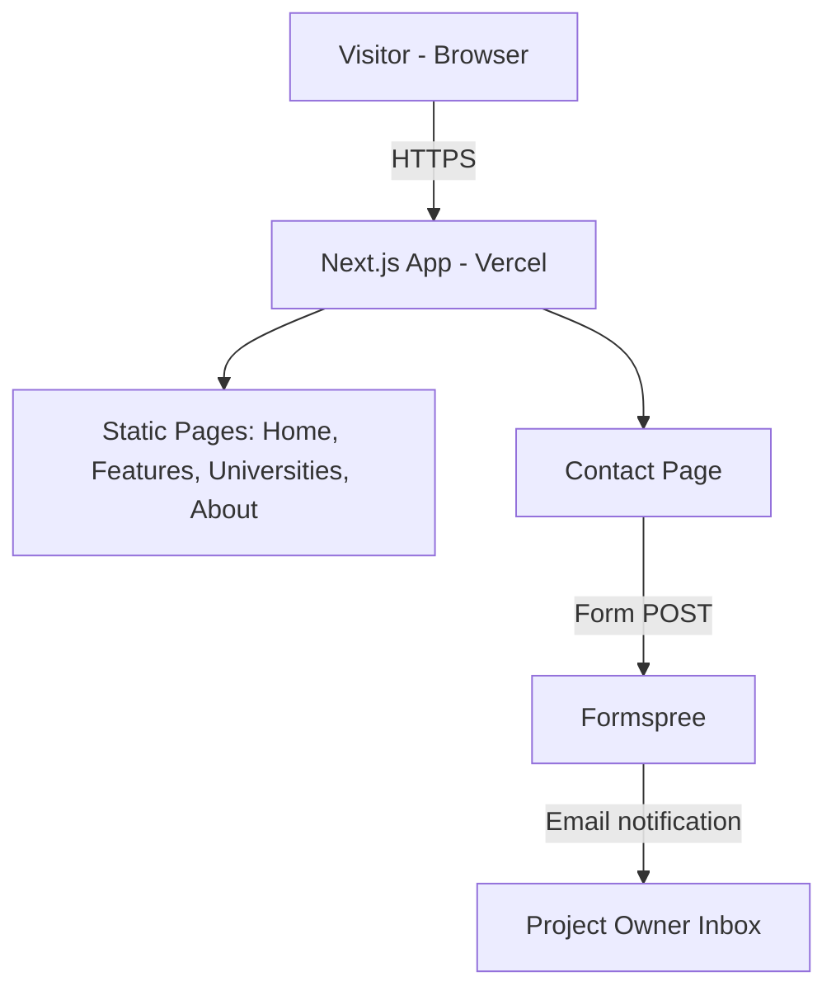

# AASP Marketing Website — Product Requirements Document

## 1. Document Control

| Field | Value |
|---|---|
| Title | AI Academic Success Platform (AASP) — Marketing Website PRD |
| Author | Claude (Sonnet 5), on behalf of the project owner |
| Date | 2026-09-04 |
| Version | 0.1 |
| Status | Draft |

---

## 2. Executive Summary

This PRD scopes a standalone marketing/informational website for the AI Academic Success Platform (AASP) — the product itself is specified separately in `PRD-AI-Academic-Success-Platform.md`. The website's job is to explain what AASP is and why it matters to three audiences (prospective pilot universities, students, and other stakeholders such as evaluators/advisors) and to convert university interest into a pilot request. It is a Next.js + Tailwind site, designed in an Apple.com-style visual language (restraint, fluid motion, generous type, translucent surfaces), deployed as a fast, mobile-friendly, largely static experience with one working form (pilot/contact request).

---

## 3. Problem Statement & Background

AASP (see the product PRD, §3) solves a real access gap for B40 students at rural/distance-learning Malaysian universities, but right now that story only exists as an internal requirements document — there is nothing to show a prospective pilot university, a student, or a capstone evaluator that communicates the product's purpose, scope, and credibility. Without a public-facing site:

- Pilot universities have no self-serve way to understand what they'd be signing up for (what data they'd upload, what "multi-tenant" means for them, what integrity risk the tool does/doesn't introduce) before a conversation starts.
- There's no single link to share with evaluators, advisors, or partners that represents the project professionally.
- There's no capture mechanism for interested universities to start a pilot conversation.

A marketing site is low-risk to build (no user accounts, no sensitive data) and high-leverage: it's the first impression for every audience this project needs to convince.

---

## 4. Goals & Non-Goals

### Goals
- **G1:** A first-time visitor (any audience) understands what AASP does and who it's for within one hero section, without scrolling.
- **G2:** A prospective pilot university can find, in under 2 minutes: the problem AASP solves, how it treats their policy data and student data (multi-tenancy, PDPA), and how to request a pilot.
- **G3:** The site reads as a polished, credible product — Apple.com-caliber visual and motion design (see `apple-design` skill) — not a placeholder capstone page.
- **G4:** A visitor can submit a pilot/contact request and the submission reliably reaches the project owner (email), with no custom backend to operate.
- **G5:** The site is fast and fully usable on mobile (the product's own target users are mobile-first, low-bandwidth — the marketing site should not contradict that story with a heavy, slow page).

### Non-Goals (this version)
- **Not** the AASP product application (no login, no chatbot, no search, no drafts) — this is a separate codebase/deploy from the platform described in the product PRD.
- **Not** a CMS-backed site. Content is authored directly in code/Markdown; no admin panel for editing copy.
- **Not** multilingual (EN/BM) for v1 of the website itself, even though the *product* is bilingual — see Open Questions.
- **Not** a blog, docs portal, or changelog.
- **Not** analytics/marketing-tech heavy (no A/B testing platform, no marketing automation) — basic page-view analytics only, if any.

---

## 5. Target Users & Personas

| Persona | What they need from the site |
|---|---|
| **University decision-maker** (library/faculty/administration evaluating a pilot) | Fast answer to "what is this, what does it need from us, is student data safe" — leads to a pilot-request action. |
| **Student (prospective end user)** | Plain-language explanation of what the tool does for them and reassurance it won't get them in trouble (integrity framing) — mostly curiosity/context, not a conversion target. |
| **Evaluator / advisor / stakeholder** (capstone grader, partner, judge) | A credible, complete picture of the product's problem, solution, and technical seriousness, reachable from one link. |

---

## 6. User Stories / Use Cases

### Landing / Orientation (Must-have)
- As any visitor, I want to immediately see a one-line description of AASP and who it's for, so I know within seconds whether to keep reading.
- As any visitor, I want a persistent way to jump to Features, For Universities, or Contact, so I can go straight to what I need.

### Understanding the Product (Must-have)
- As a visitor, I want to see the four core features (Research Discovery, Integrity Advisor, Writing Support, Source Organiser) explained in plain language with a visual, so I understand what the product actually does.
- As a visitor, I want to understand the problem AASP solves (the access gap for B40/rural/distance students), so the product's purpose is clear, not just its feature list.

### University Evaluation (Must-have)
- As a university decision-maker, I want a dedicated section/page addressing data handling, multi-tenancy, and integrity-safety-by-design, so I can assess institutional risk before reaching out.
- As a university decision-maker, I want a clear "request a pilot" call to action, so I know how to start a conversation.

### Contact / Conversion (Must-have)
- As a visitor, I want to submit a short form (name, institution/affiliation, email, message) and trust it will reach the team, so I don't need to know an email address.
- As the project owner, I want form submissions delivered to my email without me having to run or monitor a backend service.

### Credibility (Should-have)
- As an evaluator, I want to see the product's design/technical thinking reflected in the site itself (e.g., an "about the project" or "how it's built" note), so the site itself demonstrates competence, not just claims it.

---

## 7. Functional Requirements

### 7.1 Global
- **FR-1:** Persistent top navigation (translucent, blurs on scroll per Apple-style chrome) linking to Home, Features, For Universities, About, Contact.
- **FR-2:** Footer with quick links, a short project description, and contact email.
- **FR-3:** Site is a Next.js multi-page app (App Router) with the routes: `/` (Home), `/features`, `/universities`, `/about`, `/contact`.
- **FR-4:** Fully responsive from ~360px mobile width up through desktop; mobile is the primary design target, not an afterthought (matches the product's own mobile-first ethos).

### 7.2 Home (`/`)
- **FR-5:** Hero section: product name, one-sentence value proposition, primary CTA ("Request a Pilot") and secondary CTA ("See how it works" → Features).
- **FR-6:** Problem section: concise statement of the B40/rural access gap (sourced from product PRD §3), avoiding restating the full document verbatim.
- **FR-7:** Feature preview grid/sections: four cards/sections (one per core feature), each with a short description and a link to more detail on `/features`.
- **FR-8:** Persona/"who it's for" section covering students and universities.
- **FR-9:** Closing CTA section repeating the pilot-request action.

### 7.3 Features (`/features`)
- **FR-10:** One detailed section per core feature (Research Discovery, Academic Integrity Advisor, Writing Support Agent, Source Organiser), each stating: what it does, the problem it addresses, and one concrete example interaction — content drawn from product PRD §6/§7, written in plain marketing language (not restating FR numbers).
- **FR-11:** Bahasa Malaysia support and academic-integrity-safe-by-design (no auto-generated submission text) are called out explicitly as product principles, since they're differentiators.

### 7.4 For Universities (`/universities`)
- **FR-12:** Explains multi-tenancy and data isolation in plain language (no cross-university data access) — sourced from product PRD §8.2/§10 (NFR-5, NFR-6), without exposing internal architecture detail that isn't relevant to a non-technical decision-maker.
- **FR-13:** Explains what a university needs to provide to onboard (policy documents: AI-use policy, MQA guidelines, NAGI framework) and what they get (a policy admin dashboard, per product PRD §7.6).
- **FR-14:** States compliance posture (PDPA-aligned) at a level appropriate for a pilot conversation, not a legal document.
- **FR-15:** CTA to the Contact page/form, framed as "Request a Pilot."

### 7.5 About (`/about`)
- **FR-16:** Short project narrative: why AASP exists, who it's built for, and a brief note on the design/engineering approach (supports G3/credibility goal).

### 7.6 Contact (`/contact`)
- **FR-17:** Form fields: Name, Email, Institution/Affiliation (optional), Role (student/university staff/other — simple select), Message. Client-side validation (required fields, email format).
- **FR-18:** On submit, the form posts to a form-handling service (see §8) that forwards the submission to the project owner's email; the page shows a success/failure state without a page reload.
- **FR-19:** No submitted data is stored in any database owned by this project — the form-handling service is the only place submissions are held (see NFR-5).

---

## 8. Technical Architecture & Tech Stack

### 8.1 Confirmed Stack

| Layer | Choice | Notes |
|---|---|---|
| Framework | **Next.js (App Router) + Tailwind CSS** | Confirmed with the project owner — matches the AASP product's frontend stack, so patterns/components are transferable if the site is later folded into the same repo. |
| Motion | **Motion (Framer Motion successor)** | For Apple-style interruptible spring transitions, scroll-linked reveals, and translucent nav blur-on-scroll, per the `apple-design` skill. |
| Form handling | **Formspree** (or equivalent hosted form backend) | Confirmed direction: a working contact/pilot-request form with zero custom backend to operate. The form posts directly to Formspree's endpoint; Formspree emails the submission to the project owner. Requires the project owner to create a free Formspree account and supply a form endpoint ID before go-live (see Open Questions). |
| Hosting | **Vercel** | Zero-config Next.js hosting, matches the product PRD's own hosting choice (§8.1), free tier sufficient for a marketing site. |
| Content | **Authored directly in TSX/Markdown within the repo** | No CMS (non-goal, §4). |

### 8.2 System Architecture Diagram

### 8.3 Rationale for Non-Obvious Choices
- **Formspree over a custom API route + email SDK:** the ladder here is "use an already-solved service" over "write and operate a backend" — a marketing contact form has no logic worth owning; a hosted form backend eliminates a server, a secret (SMTP/email API key), and a failure mode to monitor, at the cost of a small dependency on a third party.
- **No CMS:** content changes are infrequent (this isn't a blog), and copy lives better in version control alongside the design it's paired with.
- **Reusing the product's Next.js/Tailwind choice** rather than a plain static site generator: even though this site has no app logic, keeping the stack consistent means components (nav, footer, buttons) could be shared or ported if the marketing site and product frontend are ever merged into one repo.

---

## 9. Data Model / API Design

Not applicable. The site has no database and no first-party API — the only "API" interaction is the browser's direct POST to the third-party Formspree endpoint (§8). No entities are stored by this project.

---

## 10. Non-Functional Requirements

- **NFR-1 (Performance):** Lighthouse performance score ≥ 90 on mobile; hero content visible within 1.5s on a simulated fast-3G connection — the site should not undercut AASP's own low-bandwidth-first pitch.
- **NFR-2 (Accessibility):** WCAG 2.1 AA basics — sufficient color contrast, keyboard-navigable nav and form, semantic headings, reduced-motion fallback for all scroll/spring animations (per `apple-design` skill §14).
- **NFR-3 (Responsiveness):** Fully usable from 360px width up; no horizontal scroll at any breakpoint.
- **NFR-4 (SEO basics):** Descriptive `<title>`/meta description per page, Open Graph tags for link previews (important since this site's main job is to be shared as a link).
- **NFR-5 (Privacy):** Contact form submissions are handled entirely by Formspree; this project stores no visitor-submitted personal data itself. Privacy note on the Contact page stating this.
- **NFR-6 (Availability):** Best-effort — standard Vercel static/edge hosting uptime, no formal SLA (marketing site, not the product itself).

---

## 11. Integrations & Dependencies

| Dependency | Purpose | Notes |
|---|---|---|
| **Formspree** | Contact/pilot-request form submission handling and email delivery | Requires a free-tier account and a form endpoint ID from the project owner before the Contact page can go live end-to-end. |
| **Vercel** | Hosting/deployment | Matches product PRD hosting choice; connects to the project's Git repo for CI/CD on push. |
| **Motion** (npm package) | Animation/spring library | Client-side only, no external service dependency. |

---

## 12. Milestones & Phased Rollout

| Phase | Scope | Ties to Goals |
|---|---|---|
| **Phase 0 — Scaffold** | Next.js project setup, Tailwind config, design tokens (type scale, color, spacing) per Apple-style direction, shared nav/footer components. | G3, G5 |
| **Phase 1 — Core Pages** | Home, Features, About built and content-complete. | G1, G3 |
| **Phase 2 — Universities + Contact** | For Universities page, Contact page with Formspree wired and tested end-to-end. | G2, G4 |
| **Phase 3 — Polish** | Motion/interaction pass (scroll reveals, nav blur, reduced-motion support), performance/accessibility audit, SEO/OG tags. | G3, G5, NFR-1/2/4 |

---

## 13. Risks & Mitigations

| Risk | Impact | Mitigation |
|---|---|---|
| Formspree free-tier submission limits are exceeded or the account isn't set up before launch. | Contact form silently fails to reach the project owner. | Confirm Formspree account + endpoint ID before Phase 2 sign-off; add a visible fallback (mailto: link) alongside the form as a backup contact path. |
| Site content drifts from the product PRD as the platform evolves (e.g., feature scope changes). | Marketing site misrepresents the product. | Treat product PRD §6/§7 as the source of truth; re-check website copy whenever the product PRD's Goals/Functional Requirements sections change. |
| Heavy animation undermines the low-bandwidth story the product is built around. | Slow/janky mobile experience contradicts G5 and the product's own value proposition. | Keep imagery minimal/vector-based, gate motion behind `prefers-reduced-motion`, budget-check with Lighthouse per NFR-1. |

---

## 14. Open Questions / Assumptions

- **English-only for v1 (assumption):** The website itself is English-only even though the product supports EN/BM, since the primary near-term audience (pilot university decision-makers, evaluators) is assumed English-comfortable. Flag if a Bahasa Malaysia version of the marketing site is actually required for this phase.
- **Formspree specifically vs. another hosted form service (assumption):** Formspree is named as a concrete, well-known example of "hosted form backend, no server to run." Any equivalent service (Web3Forms, Basin, Getform) satisfies the same requirement — final choice can be swapped without changing this PRD's intent. The project owner needs to create the account and supply the endpoint ID.
- **No analytics specified:** This PRD does not include an analytics requirement (e.g., Plausible, Vercel Analytics) since none was requested — flag if visit/conversion tracking is actually wanted.
- **Domain/URL:** No custom domain was specified; assumed the site ships on a Vercel-provided `*.vercel.app` URL for now, with a custom domain as a future addition if desired.
- **Relationship to the product repo:** Assumed this website is a separate Next.js project (in `D:\Capstone1\website`) rather than a route group inside the eventual AASP product app — revisit if the two should actually share one deployment.

---

## 15. Appendix

### Glossary
See product PRD (`PRD-AI-Academic-Success-Platform.md`) §15 for domain terms (AASP, B40, MQA, NAGI, DOAJ, RAG, pgvector, Tenant, PDPA).

### Source Material
- Content and positioning derived from `D:\Capstone1\PRD-AI-Academic-Success-Platform.md` (product PRD), particularly §3 (Problem Statement), §4 (Goals), §5 (Personas), §6/§7 (Features/Requirements), and §8.2/§10 (multi-tenancy, compliance).
- Visual/interaction design direction from the `apple-design` skill (fluid motion, restraint, translucency, typography).
- Tech stack, page scope, and form-handling approach confirmed via a clarification round with the project owner prior to drafting.
