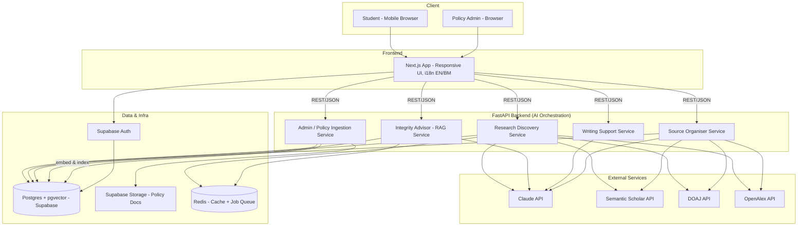
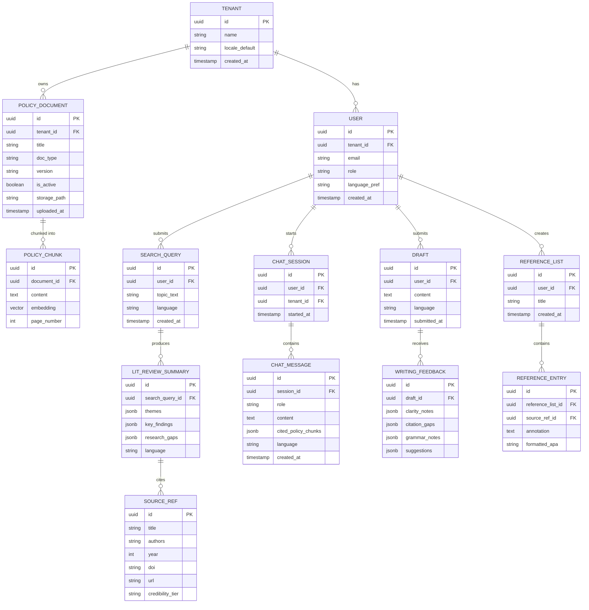
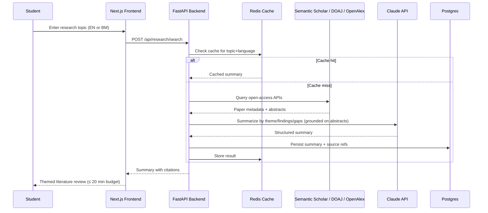
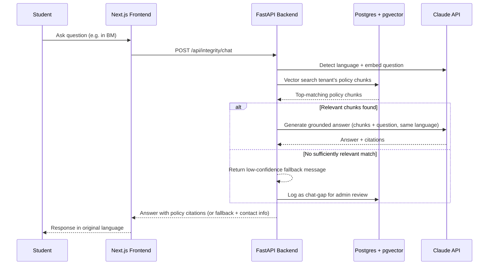

# AI Academic Success Platform — Product Requirements Document

## 1. Document Control

| Field | Value |
|---|---|
| Title | AI Academic Success Platform (AASP) — PRD |
| Author | Claude (Sonnet 5), on behalf of the project owner |
| Date | 2026-09-04 |
| Version | 0.1 |
| Status | Draft |

---

## 2. Executive Summary

The AI Academic Success Platform (AASP) is a mobile-first, multi-tenant web platform that gives B40 undergraduate students in rural and distance-learning Malaysian universities the research, citation, and writing support they would otherwise get from a campus library or writing tutor. Students can discover and summarise open-access literature, get institution-specific answers about AI-use and academic integrity policy, receive structured (non-generative) feedback on their own writing, and turn a rough source list into a properly formatted, credibility-checked reference list — in English or Bahasa Malaysia, on a low-cost Android phone with limited data. The prototype targets a single measurable outcome: a student with no library or tutor access can find 5 credible sources, learn how to cite them, and confirm whether their AI usage is policy-compliant, in under 20 minutes.

---

## 3. Problem Statement & Background

B40 students in rural campuses and distance-learning programmes face a structural access gap: no physical library, no walk-in writing centre, and often no counsellor to ask "is this allowed?" before submitting work. This gap has three compounding costs:

1. **Research quality gap** — students rely on whatever surfaces in a generic web search, missing peer-reviewed literature and producing weaker literature reviews.
2. **Integrity risk gap** — without access to someone who can explain *their specific university's* AI-use policy, MQA (Malaysian Qualifications Agency) integrity guidelines, and the national AI ethics framework (NAGI), students either avoid AI tools entirely (losing a legitimate productivity aid) or misuse them and risk misconduct proceedings — a disproportionately high-stakes outcome for students who already have the least institutional support.
3. **Writing quality gap** — no tutor to review drafts means structural and citation problems surface only at grading, when it's too late to fix them.

Existing tools solve pieces of this (Google Scholar for search, Grammarly for grammar, Turnitin for similarity after the fact) but none of them are (a) grounded in the student's own institution's policy documents, (b) usable in Bahasa Malaysia, or (c) designed for the connectivity and device constraints this user group actually has. AASP consolidates these into one low-bandwidth platform, deliberately scoped to *support* rather than *replace* student authorship.

---

## 4. Goals & Non-Goals

### Goals
- **G1 (Primary success metric):** A student with no library/tutor access can find 5 credible sources, understand how to cite them, and check whether their AI tool usage is policy-compliant — end to end in ≤ 20 minutes on a mobile connection with limited data.
- **G2:** All guidance on integrity/AI-use is grounded in the student's *own institution's* actual policy documents, not generic web knowledge — with source citations back to the policy text.
- **G3:** Every core function (search, chatbot, writing feedback, source organiser) works in both English and Bahasa Malaysia, including BM-in/BM-out chatbot conversations.
- **G4:** The Writing Support Agent measurably improves structural/citation quality of drafts without ever generating substitute content — feedback-only by design, to keep the tool integrity-safe by construction.
- **G5:** The platform architecture supports onboarding additional universities (multi-tenant) without a re-architecture, even though the prototype ships with one or a small number of pilot institutions loaded.

### Non-Goals (this version)
- **Not** a plagiarism-similarity checker (e.g., Turnitin-style text-matching against a corpus). The Academic Integrity Advisor explains rules; it does not scan submissions for copied text.
- **Not** a full LMS, gradebook, or assignment-submission system.
- **Not** building custom university SSO/identity federation in this phase — simple email/password auth now, SSO documented as a future integration.
- **Not** downloading, storing, or redistributing full text of paywalled/copyrighted papers — the platform indexes and links to open-access sources only.
- **Not** a live human tutor, counsellor, or librarian replacement — no human-in-the-loop support in this version.
- **Not** a native iOS/Android app — a responsive mobile web app only (installability/offline caching explicitly deferred, see §14).
- **Not** a content generator — the Writing Support Agent will not draft, rewrite, or complete paragraphs/abstracts on the student's behalf.

---

## 5. Target Users & Personas

| Persona | Description | Core Need |
|---|---|---|
| **Amirah — B40 Undergraduate (Primary)** | Distance-learning or rural-campus student, budget Android phone, prepaid mobile data, moderate English proficiency, comfortable in Bahasa Malaysia. No campus library or writing centre access. | Fast, low-data, trustworthy answers to "what sources exist," "can I cite/use this," "is my AI use okay," "is my draft good enough" — without needing to travel or wait for a human. |
| **Faculty/Library Policy Admin (Secondary)** | University staff responsible for academic integrity policy, uploads and maintains their institution's AI-use policy, integrity guidelines, and citation-standard documents into the platform. | A simple way to keep the policy knowledge base accurate and current for their students, and visibility into what the chatbot is telling students. |
| **Platform Super-Admin (Tertiary)** | Operates the platform across multiple onboarded universities. | Tenant management, usage/cost monitoring, quality oversight (e.g., flagged low-confidence chatbot answers). |

---

## 6. User Stories / Use Cases

### Research Discovery (Must-have)
- As a student, I want to type a research topic in English or BM and get a summarised literature review organised by theme, so I don't have to manually read dozens of papers to find relevant ones.
- As a student, I want the summary to call out research gaps, so I can position my own assignment/thesis angle.
- As a student, I want results to load and remain usable on a slow/limited-data connection, so I'm not burning my data plan on a failed search.

### Academic Integrity Advisor (Must-have)
- As a student, I want to ask "can I use ChatGPT to summarise my readings?" and get an answer based on *my university's* actual policy, so I don't accidentally commit misconduct.
- As a student, I want to ask in Bahasa Malaysia and get an answer in Bahasa Malaysia, so language isn't a barrier to understanding the rules.
- As a student, I want the chatbot to tell me when it's unsure and point me to a real staff contact, so I don't get false confidence on a high-stakes question.

### Writing Support Agent (Must-have)
- As a student, I want to paste a paragraph or abstract and get feedback on argument clarity, citation gaps, and grammar, so I can improve it myself before submitting.
- As a student, I want the tool to explicitly refuse to rewrite my paragraph for me, so I know my submission stays my own work.

### Source Organiser (Must-have)
- As a student, I want to paste a list of URLs or paper titles and get a formatted reference list with annotations, so I don't have to manually format citations.
- As a student, I want each source flagged as peer-reviewed, blog post, or grey literature, so I know what I can rely on academically.

### Bahasa Malaysia Support (Must-have)
- As a student, I want to switch the whole interface and chatbot to Bahasa Malaysia, so I can use the platform in my preferred language.

### Policy Knowledge Base / Admin (Should-have)
- As a policy admin, I want to upload my university's AI-use policy, MQA guidelines, and the NAGI framework document, so the chatbot answers reflect our institution specifically.
- As a policy admin, I want to see which chatbot answers had low confidence or no matching policy text, so I can identify gaps in our documentation.

### Accounts (Should-have)
- As a student, I want to create a simple account, so my search history, drafts, and reference lists are saved across sessions.

---

## 7. Functional Requirements

### 7.1 Research Discovery
- **FR-1:** Student submits a free-text research topic (English or BM, ≤ 300 characters).
- **FR-2:** System queries open-access sources — Semantic Scholar API, DOAJ API, and OpenAlex API (see §14 for the Google Scholar substitution rationale) — for relevant papers.
- **FR-3:** System deduplicates results across sources by DOI/title similarity.
- **FR-4:** System generates a literature review summary organized by: (a) theme/sub-topic clusters, (b) key findings per theme, (c) identified research gaps, using an LLM grounded in retrieved abstracts/metadata only (no fabricated findings).
- **FR-5:** Each summarized claim links back to its source paper (title, authors, year, link).
- **FR-6:** Student can request the summary in English or Bahasa Malaysia regardless of the language the query was typed in.
- **FR-7:** Long-running searches return a "searching…" state with partial/streamed results rather than a blocking spinner (see NFR performance requirements).
- **FR-8:** Search results and generated summaries are cached (by normalized topic + language) to reduce repeat latency/cost.

### 7.2 Academic Integrity Advisor
- **FR-9:** Chatbot answers questions about AI-use rules, plagiarism definitions, citation methods (APA; MQA-aligned guidance), and misconduct consequences.
- **FR-10:** Chatbot answers are generated via retrieval-augmented generation (RAG) grounded strictly in the student's institution's uploaded policy documents (AI-use policy, MQA guidelines, NAGI framework) — not general LLM knowledge.
- **FR-11:** Every chatbot answer cites the specific policy document/section it drew from.
- **FR-12:** When no sufficiently relevant policy text is found, the chatbot states it cannot confidently answer and directs the student to contact their faculty/integrity office, rather than guessing.
- **FR-13:** Chatbot detects the language of the incoming question and responds in the same language (EN or BM).
- **FR-14:** Conversation history is retained per student session/account for continuity within a session.

### 7.3 Writing Support Agent
- **FR-15:** Student pastes a draft paragraph or abstract (text input, character-limited for cost control).
- **FR-16:** System returns structured feedback across fixed categories: argument clarity, citation gaps (missing/weak citations), grammar issues, and improvement suggestions.
- **FR-17:** Feedback is delivered as commentary/suggestions only — the system must never output a rewritten version of the student's paragraph as a drop-in replacement.
- **FR-18:** Feedback is available in English or Bahasa Malaysia, matching the student's selected interface language.
- **FR-19:** Each feedback session is saved to the student's account history for before/after comparison.

### 7.4 Source Organiser
- **FR-20:** Student submits a list of URLs and/or paper titles (up to a defined batch limit, e.g. 20 per request).
- **FR-21:** System resolves each entry to a canonical source record (via DOI/metadata lookup against Semantic Scholar/OpenAlex/DOAJ, or basic web metadata extraction for non-indexed URLs).
- **FR-22:** System outputs a formatted reference list in APA style (MQA-aligned formatting notes where applicable).
- **FR-23:** System generates a 1–2 sentence annotation per source summarizing its content/relevance.
- **FR-24:** System classifies each source's credibility tier: peer-reviewed journal, conference paper, grey literature (report/thesis/preprint), or non-academic (blog/news/other) — with a stated basis for the classification (e.g., "indexed in DOAJ as peer-reviewed").
- **FR-25:** Unresolvable entries (dead link, no metadata found) are flagged explicitly rather than silently dropped.

### 7.5 Bahasa Malaysia Support
- **FR-26:** All UI chrome (navigation, labels, buttons, error messages) is available in English and Bahasa Malaysia via a persistent language toggle.
- **FR-27:** Language preference is stored per account and applied by default on return visits.
- **FR-28:** All four core features (Research Discovery, Integrity Advisor, Writing Support, Source Organiser) function fully in BM, not just the static UI shell.

### 7.6 Policy Knowledge Base (Admin)
- **FR-29:** A policy admin (per tenant/university) can upload policy documents (PDF/DOCX) — AI-use policy, MQA guidelines, NAGI framework, and any institution-specific integrity documents.
- **FR-30:** Uploaded documents are chunked, embedded, and indexed for retrieval, scoped strictly to that university's tenant.
- **FR-31:** Admin can view/replace/deactivate a document version; the Integrity Advisor always retrieves against the current active version only.
- **FR-32:** Admin has a basic dashboard showing chatbot questions that returned a "low confidence / no match" response (FR-12), to identify policy documentation gaps.

### 7.7 Accounts & Multi-Tenancy
- **FR-33:** Students register/log in with email + password, associated with exactly one university tenant.
- **FR-34:** All student-generated data (searches, drafts, reference lists, chat history) is scoped and isolated per tenant; no cross-tenant data access under any account.
- **FR-35:** Platform super-admin can onboard a new university tenant (name, branding basics, initial policy admin account).

---

## 8. Technical Architecture & Tech Stack

### 8.1 Confirmed Stack

| Layer | Choice | Notes |
|---|---|---|
| Frontend | **Next.js (React) + Tailwind CSS**, responsive web app | Confirmed. Standard responsive design for this phase — PWA/offline explicitly deferred (see §14). |
| Backend / AI orchestration | **FastAPI (Python)** | Python chosen over Node for the AI/RAG/embeddings orchestration layer — Python's ecosystem (embedding libraries, LLM SDKs, PDF parsing) is the better fit for this workload. Next.js uses thin API routes only as a BFF for auth/session glue; all AI logic lives in FastAPI. *(Flagged as an assumption in §14 — confirm this frontend/backend split is acceptable.)* |
| Database | **Postgres with `pgvector`** (via Supabase) | Single database for both relational data (users, tenants, references) and vector embeddings (policy chunks, paper abstracts) — avoids running a separate vector DB for a prototype. |
| Auth | **Supabase Auth** (email/password) | SSO (SAML/OAuth via university IdP) documented as future work. |
| File storage | **Supabase Storage** | Stores uploaded policy PDFs/DOCX. |
| LLM | **Claude API (Anthropic)** | Used for: literature review summarization, RAG-grounded integrity chatbot, writing feedback generation, source credibility classification, and BM↔EN language handling. Chosen for strong multilingual (BM) performance and long-context grounding needed for policy-document RAG. |
| Caching / queue | **Redis (Upstash free tier)** | Caches search results and generated summaries (cost + speed); backs a lightweight background job queue for long-running search/summarization tasks. |
| Open-access literature APIs | **Semantic Scholar API, DOAJ API, OpenAlex API** | Free, no-key-required-or-low-friction APIs. See §14 for why Google Scholar itself is not directly integrated. |
| Hosting | **Vercel** (frontend) + **Railway or Render** (FastAPI backend/workers) + **Supabase** (DB/Auth/Storage) | Low-ops, mostly-free-tier hosting suited to a prototype budget. |
| i18n | **next-intl** (or i18next) for UI strings; explicit language directive passed into every LLM prompt | Ensures both static UI and dynamic AI output respect the selected language. |

### 8.2 Multi-Tenancy Approach

Confirmed as multi-tenant from day one. Implemented via a shared database with **row-level tenant scoping** (a `tenant_id` column on every tenant-owned table, enforced by Postgres Row-Level Security policies in Supabase) rather than separate databases per university. This keeps prototype infrastructure simple while still guaranteeing data isolation, and is a straightforward migration path to physically separate databases later if a pilot university requires it contractually.

### 8.3 System Architecture Diagram

### 8.4 Rationale for Non-Obvious Choices
- **Single Postgres + pgvector instead of a dedicated vector DB:** fewer moving parts, one connection pool, one backup story — appropriate at prototype scale (low thousands of policy chunks and cached abstracts). Revisit if per-tenant document volume grows large enough to need dedicated vector infra.
- **Redis caching layer:** given the explicit low-bandwidth/limited-data constraint, avoiding repeat LLM calls and repeat external-API round trips for the same or similar queries is both a cost control and a latency/UX requirement, not an optimization.
- **RLS-based multi-tenancy over separate DBs per tenant:** satisfies "multi-tenant from day one" without prototype-stage operational overhead of provisioning a database per university.
- **Claude API as the single LLM provider** across all four AI features: consistent prompt/response behavior, one vendor integration to secure and monitor cost against, and strong bilingual (EN/BM) and long-context grounding support needed for policy RAG and literature summarization.

---

## 9. Data Model / API Design

### 9.1 Entity Relationship Diagram

### 9.2 Key API Endpoints

| Method & Path | Purpose |
|---|---|
| `POST /api/auth/register`, `/api/auth/login` | Student/admin account creation and session auth (Supabase Auth-backed). |
| `POST /api/research/search` | Submit a topic; returns a job id, streams/polls for the literature review summary. |
| `GET /api/research/search/{id}` | Retrieve a completed (or in-progress) summary with theme/findings/gaps and source citations. |
| `POST /api/integrity/chat` | Send a chatbot message; returns a grounded answer with cited policy chunks, in the detected language. |
| `GET /api/integrity/chat/{session_id}` | Retrieve chat history for a session. |
| `POST /api/writing/feedback` | Submit a draft paragraph/abstract; returns structured feedback (clarity, citation gaps, grammar, suggestions). |
| `POST /api/sources/organize` | Submit a list of URLs/titles; returns formatted references, annotations, and credibility tiers. |
| `POST /api/admin/policies` | (Policy admin) Upload a policy document for the admin's tenant; triggers chunk/embed/index pipeline. |
| `PATCH /api/admin/policies/{id}` | Activate/deactivate or replace a policy document version. |
| `GET /api/admin/chat-gaps` | (Policy admin) List recent low-confidence/no-match chatbot answers for that tenant. |
| `POST /api/super-admin/tenants` | (Super-admin) Onboard a new university tenant. |

### 9.3 Research Discovery Sequence

### 9.4 Academic Integrity Advisor Sequence

---

## 10. Non-Functional Requirements

- **NFR-1 (Latency/Performance):** Initial page load ≤ 3s on a simulated 3G/limited-bandwidth connection (~150–400 kbps); chat and feedback responses stream token-by-token rather than waiting for full completion, so perceived latency stays low even on slow links.
- **NFR-2 (Data footprint):** Frontend bundle and page payloads are kept minimal (no heavy images/video, text-first layouts) — every screen should be usable within a modest per-session data budget, in line with the platform's mobile-data-constrained target user.
- **NFR-3 (End-to-end success metric):** The full flow of finding 5 credible sources, understanding citation, and checking AI-use permission must be completable in ≤ 20 minutes (G1) — this is a design constraint on every feature's step count and load time, not just an aspirational target.
- **NFR-4 (Scalability):** Prototype sized for pilot-scale concurrent usage (tens to low hundreds of active students across onboarded tenants); architecture (stateless FastAPI services, managed Postgres, external cache) supports horizontal scaling later without redesign.
- **NFR-5 (Security & Privacy):** All traffic over TLS; data encrypted at rest (Supabase default); tenant data isolation enforced via Postgres RLS (FR-34); students can delete their own drafts/history; no long-term retention of full copyrighted paper text.
- **NFR-6 (Compliance):** Designed with Malaysia's Personal Data Protection Act 2010 (PDPA) in mind — explicit consent on account creation, data minimization, and a documented data-deletion path for account closure.
- **NFR-7 (Accessibility):** UI meets WCAG 2.1 AA basics (contrast, font scaling, screen-reader-navigable structure); language toggle (EN/BM) is a persistent, one-tap control, not buried in settings.
- **NFR-8 (Availability):** Best-effort availability appropriate to a prototype (no formal SLA); graceful degradation if an external literature API is down (fall back to the remaining sources rather than failing the whole search).
- **NFR-9 (Cost control):** Per-tenant usage/cost monitoring on LLM and external API calls; caching (§8.1) and rate limiting are load-bearing cost controls, not optional polish.
- **NFR-10 (Academic-integrity-safe-by-design):** The Writing Support Agent (FR-17) and Integrity Advisor (FR-12) are architecturally prevented from producing drop-in submission content or unfounded policy claims — this is a product-integrity requirement, not just a UX preference.

---

## 11. Integrations & Dependencies

| Dependency | Purpose | Notes |
|---|---|---|
| **Semantic Scholar API** | Open-access paper search/metadata | Free, API-key optional for higher rate limits. |
| **DOAJ API** | Open-access journal/article search | Free, no key required. |
| **OpenAlex API** | Broad open scholarly metadata; substitutes for Google Scholar | Free, no key required. See §14 for why this replaces direct Google Scholar integration. |
| **Claude API (Anthropic)** | Summarization, RAG-grounded chat, writing feedback, credibility classification, EN/BM handling | Primary LLM dependency across all four features; cost and rate limits must be monitored per NFR-9. |
| **Supabase** | Postgres + pgvector, Auth, Storage | Single managed backend for data, auth, and files. |
| **Upstash Redis** | Caching + lightweight job queue | Free-tier suitable for prototype load. |
| **Vercel** | Frontend hosting | Free-tier suitable for prototype load. |
| **Railway / Render** | FastAPI backend hosting | Low-cost managed container hosting. |

---

## 12. Milestones & Phased Rollout

| Phase | Scope | Ties to Goals |
|---|---|---|
| **Phase 0 — Foundation** | Tenant/account model, auth, i18n scaffolding (EN/BM), policy document upload + chunk/embed pipeline, base UI shell. | G3, G5 |
| **Phase 1 — MVP: Find Sources** | Research Discovery + Source Organiser fully working end-to-end, cached, mobile-optimized. | G1, G4 (partial) |
| **Phase 2 — Integrity Advisor** | RAG-grounded chatbot live against real uploaded policy docs, EN/BM, citation + low-confidence fallback. | G1, G2, G3 |
| **Phase 3 — Writing Support** | Structured, non-generative feedback agent live, EN/BM. | G1, G4 |
| **Phase 4 — Pilot Hardening** | Real pilot university onboarded, admin dashboards (chat-gap review, policy versioning), performance tuning for low-bandwidth conditions, cost/usage monitoring. | G1–G5 |
| **Post-Prototype (Future)** | University SSO integration, PWA/offline support, native app, plagiarism-similarity checking, additional languages, additional literature sources (e.g. licensed Google Scholar access via a paid API). | — |

---

## 13. Risks & Mitigations

| Risk | Impact | Mitigation |
|---|---|---|
| Google Scholar has no official public API; scraping it risks ToS violations and instability. | Research Discovery quality/reliability. | Use Semantic Scholar + DOAJ + OpenAlex as the primary indexed sources (documented substitution, see §14); revisit a licensed scraping API (e.g. SerpAPI) only if a real Google Scholar coverage gap is confirmed post-pilot. |
| LLM hallucination on integrity/AI-use guidance is a high-stakes failure mode — a wrong answer could lead a student into a misconduct case. | Student harm, institutional trust. | Strict RAG grounding (FR-10), mandatory source citation (FR-11), explicit low-confidence fallback to a human contact (FR-12) instead of guessing. |
| LLM API cost scales with usage and could exceed a prototype budget. | Project sustainability. | Aggressive caching (§8.1), per-tenant rate limits, prompt/response size limits, monitoring dashboard (NFR-9). |
| Low-bandwidth/mobile-data UX failure — if the app feels slow or data-heavy, the target user will simply stop using it. | Adoption, defeats the core purpose of the platform. | Text-first UI, streamed responses, payload budgets (NFR-1/NFR-2), degrade external-source failures gracefully rather than blocking the whole flow. |
| Bahasa Malaysia output quality for academic/technical register may be weaker than English, especially for domain-specific terms (citation styles, policy terminology). | G3 quality, user trust in BM mode. | Explicit BM academic-register prompting; allow policy admins to supply a glossary of preferred BM terms; pilot review of BM outputs by BM-speaking staff before wider rollout. |
| Multi-tenant data leakage (one university seeing another's policy data or student data). | Severe trust/compliance failure. | Postgres RLS enforced at the database layer (not just application logic) on every tenant-scoped table; periodic access audits. |
| Copyright exposure from indexing/storing full paper text. | Legal risk. | Only abstracts/metadata are stored; full text is never fetched or redistributed — students are linked out to the original open-access source. |
| Writing Support Agent could be misused/pressured into generating submission-ready text despite design intent. | Undermines the platform's own academic-integrity mission. | Prompt-level and output-validation guardrails that refuse to return full rewritten paragraphs; feedback-only response schema (FR-16/FR-17) enforced at the API contract level, not just prompt instruction. |

---

## 14. Open Questions / Assumptions

- **Google Scholar substitution (needs confirmation):** Google Scholar has no free official API. This PRD assumes Semantic Scholar + DOAJ + OpenAlex provide sufficient open-access coverage for the prototype. If true Google Scholar results are a hard requirement, a paid scraping API (e.g., SerpAPI) would need to be budgeted and added as a dependency — please confirm which direction to take.
- **Frontend/backend split (assumption):** The confirmed stack choice was described as "Next.js + Node/Python API"; this PRD assumes the backend is FastAPI (Python) for the AI/RAG workload, with Next.js used only for the frontend and thin auth/session API routes (no separate Node service). Flag if a distinct Node service was actually intended.
- **"MQA standard" citation format (assumption):** The requirements reference "APA, MQA standard" citation methods. This PRD assumes MQA does not itself define a distinct citation *format* but rather sets integrity/quality guidelines that sit alongside APA as the practical citation style used. If MQA specifies its own formatting rules, those details need to be supplied so the Source Organiser (FR-22) can implement them precisely.
- **NAGI framework content (assumption):** The specific NAGI AI ethics framework document(s) are assumed to be supplied by each onboarding university (or a national default) as part of the Policy Knowledge Base upload (FR-29) — this PRD does not fabricate or assume its content.
- **Pilot scale (assumption):** Sized for tens to low hundreds of concurrent pilot students (NFR-4) in the absence of a stated target enrollment; revisit sizing once a real pilot university/cohort is confirmed.
- **Compliance regime (assumption):** PDPA (Malaysia) is treated as the relevant data protection law given the Malaysian university context; confirm if any onboarded institution has additional regional requirements (e.g., for distance-learning students located outside Malaysia).
- **Timeline/budget:** No explicit timeline or budget was provided; the phased plan in §12 assumes a capstone/prototype-style short build cycle. Confirm if a hard deadline should reshape phase scope.
- **PWA/offline support:** Explicitly deferred per the confirmed answer (standard responsive web app for this stage) — flagged here as a known future gap given the stated low-bandwidth target user, in case priorities shift once real usage data comes in.

---

## 15. Appendix

### Glossary
- **B40** — Malaysia's bottom 40% household income group, a key national policy target population.
- **MQA** — Malaysian Qualifications Agency, the national quality-assurance body for higher education.
- **NAGI** — The National AI ethics/governance framework referenced by the requirements as a grounding source for AI-use guidance.
- **DOAJ** — Directory of Open Access Journals.
- **RAG** — Retrieval-Augmented Generation; grounding an LLM's answer in retrieved source documents rather than its general training knowledge.
- **pgvector** — A Postgres extension enabling vector similarity search, used here for embedding-based document/paper retrieval.
- **Tenant** — In this platform, one onboarded university; all tenant-scoped data is isolated per university.
- **PDPA** — Malaysia's Personal Data Protection Act 2010.

### Source Material
- Requirements dictated directly by the project owner in chat, captured 2026-09-04.
- Tech stack, multi-tenancy scope, auth approach, and delivery format (responsive web vs. PWA) confirmed via a clarification round with the project owner prior to drafting (see decisions reflected throughout §8 and §14).
